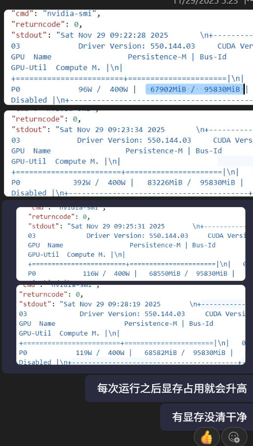
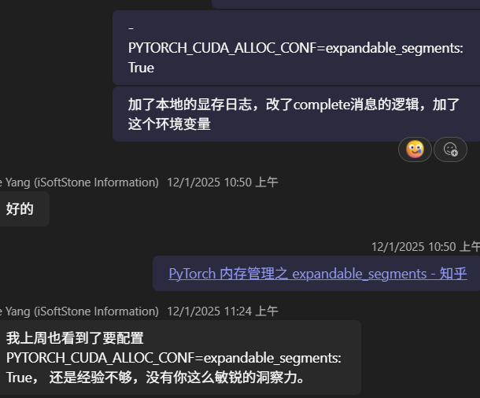
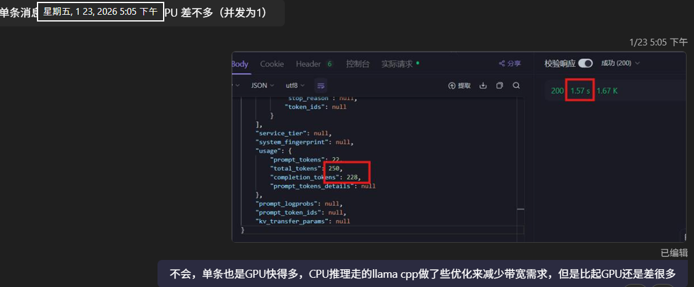
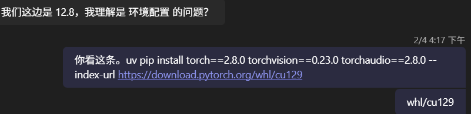

# 模型问题排查案例集

这一年多从文生文做到文生图、文生视频，从系统设计到线上排查，遇到的问题大多集中在 CUDA 上层，本质上都是工程问题。这里挑几道上半年比较有代表性的 case 记一下。它们其实有个共通点：只要把问题描述清楚，解法往往就很直接；真正花时间的，是一开始信息几乎为零，得在盲人摸象里一点点定位。我尽量把当时的排查过程原样记下来，给以后的自己留点经验。

## H100 部署视频模型，跑一段时间就 OOM

Wan2.2-14B 在内部集群正常部署，Worker 也能正常消费 MQ 消息，但压测跑一段时间之后 Worker 就 Crash 了，报 CUDA OOM。

我先怀疑是 CUDA 版本，又怀疑代码哪里有问题，但同样的 Worker 代码在 H20 上能稳定压测一个小时，代码的嫌疑基本排除。接着怀疑机器掉了 GPU 驱动。H100 这套平台我们没有机器权限，只能通过一个 portal 指定 Image 和 weight 去部署，机器上不去，就给 Worker 镜像开了个 API 接口，能在容器里跑点命令。拿 nvidia-smi 一看，即使空闲状态显存也是满的，94568MiB / 95830MiB。压测期间我不停 ping 这个接口，发现显存是一路往上涨、涨到顶才报错，于是怀疑显存泄漏，在 Worker 内部加了点主动清理显存的逻辑，结果部署上去照样报错。

其实空闲时 nvidia-smi 显存占满本身并不能说明泄漏——PyTorch 的 caching allocator 默认会把 reserve 到的显存一直攥着、不还给驱动，泄漏、碎片、正常缓存这三种情况它看上去都一个样。多次尝试无果之后，我转去怀疑显存碎片化，加上 PYTORCH_CUDA_ALLOC_CONF=expandable_segments:True 再压测，就正常了。这个问题前后在周末花了一天半做实验才定位出来——挑周末是因为线上流量小，我先拿 1.3B 顶在线上应对下游的消费流量。

所以根因不是泄漏，是碎片化。expandable_segments 会让 PyTorch 的分配器改用一段可增长的虚拟地址来 back 显存，不再要求大块连续的物理段，碎片自然就缓解了。视频扩散模型每个请求的分辨率、帧数、序列长度都在变，分配出来的显存块尺寸很杂，本来就是最容易碎片化的场景。最近看知乎那篇文章也提到，碎片化的问题正从训练侧转移到推理侧。

## 视频生成架构的 DB Race Condition

视频生成服务里，VideoGenService 和 VideoGenWorker 都会往同一张表写状态。最初对接的时候两个人各写各的逻辑，统一时序图上也没体现这块，压测时就发现有些请求的状态乱掉了——典型的两个 writer 没有统一时序，互相覆盖。

那会儿刚好在推 vibe coding，我先让两个人各自排查自己那部分，但 vibe coding 的后遗症就是代码冗余，其中一位怎么也 debug 不清楚。后来我和 Worker 的小伙伴加班，从一条 VideoGen 的 post 请求开始，顺着一路盯数据库的状态码变化。服务都在内网、机器又上不去，只能靠状态码的跳变反推时序，最后把两边写库打架的点找了出来。

## TTFT：H20 跑不过 Ollama CPU

下游反馈我们 H20 的 TTFT 还跑不过他本地的 Ollama CPU。帮他 debug 了一圈，发现是他本地网络把 Latency 拖慢了。这其实是老问题——客户端量到的 TTFT 里裹着网络、排队、prefill 和首 token 好几段，H20 在 prefill 上不可能真输给 CPU，慢就只能慢在网络或排队上。模型服务层最难受的地方也在这儿：下游永远先说“你 API 有问题”，可问题可能出在网络，也可能是他自己的 prompt、推理架构，甚至模型真有问题，但所有情况都先路由到 API 层来诊断。这种事见多了，凭经验基本就能判出来。

## GUI Model 精度漂移

有个支持 GUI 桌面操作的模型，它选中的坐标和对方在本地 GPU 上跑出来的坐标有细微差别。排查模型输出对不齐这类问题套路比较固定，先对齐环境：把 tp=1 换成对方用的 TP=2，再校验两边权重的 MD5，确认是同一个模型版本。然后让下游发了个测试脚本过来，同样的脚本在我们机器上跑确实有偏差，不过不大，就差几个像素。小伙伴觉得到这儿差不多能定论了，算可用。但我直觉这事不对劲——这种规模的工程项目，算子质量我还是信的，不认为这点偏差是噪音。于是让两边都统一到 vLLM 0.11，问题照旧。我干脆要来他们本地的 dependency 文件，一看是 cu129，就让组员把我们在用的 cu128 也换成 cu129，偏差就消失了。

根因是两边 wheel 绑的 cuBLAS/cuDNN 版本不一样，GEMM 的 kernel 选择和归约顺序跟着变，浮点结果最后几位就对不齐。文本生成被采样和 argmax 掩盖了看不出来，但坐标这种连续输出会被直接放大成几个像素的偏移。所以严格说两边算子各自都没错，只是跨库版本之间做不到逐位一致——与其说是精度漂移，不如说是数值不可复现。

## 写在最后

回头看这几个 case，最后的解法其实都很短：一个 expandable_segments，一个 cu128 换 cu129，真正改动的可能就一两行。有些是老问题换了新场景，新瓶装旧酒，但更多时候还是得一点一点趟过去，才能把那句“它崩了”磨成一句讲得清楚的话。最近在做 PD 分离的排查和推测解码的验证，后续再补上来。